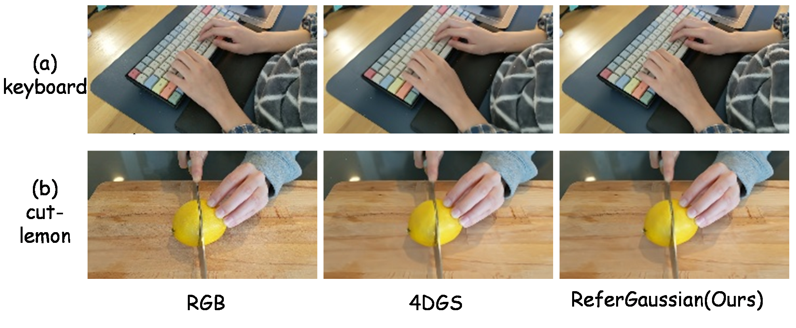

# HyperGaussian: Referring 4D Gaussian Splatting

<div align="center">

[](LICENSE)
[](#environment-setup)
[](#environment-setup)

[Project Page](https://trump0412.github.io/HyperGaussian/) | [Paper](#citation) | [Dataset](https://huggingface.co/datasets/Trump0412/HyperGaussian-R4D-Bench-QA)

</div>

---

**HyperGaussian** is a unified framework for Referring 4D Gaussian Splatting (R4DGS) — the task of grounding natural-language queries in dynamic 4D scenes. It handles temporally varying, multi-target, reasoning-intensive, and zero-target queries without retraining the scene representation.

<p align="center">
  
  <br>
  <em>Dynamic Reconstruction builds the 4D Gaussian scene. The Qwen-based Hyper-Planner drives three stages: static segmentation, semantic assignment (EntityBank), and training-free spatiotemporal grounding.</em>
</p>

## Results

### R4D-Bench-QA — joint referring + reconstruction

| Method | Acc ↑ | vIoU ↑ | PSNR ↑ | SSIM ↑ | LPIPS ↓ |
|---|---|---|---|---|---|
| Segment then Splat | 55.6 | 28.4 | 20.3208 | 0.7027 | 0.3971 |
| 4D LangSplat | 58.4 | 32.1 | 20.3208 | 0.7027 | 0.3971 |
| **HyperGaussian (Ours)** | **76.5** | **34.4** | **20.4159** | **0.7069** | **0.4082** |

### Generalization — 4D LangSplat HyperNeRF split

| Method | Acc ↑ | vIoU ↑ |
|---|---|---|
| LangSplat | 54.27 | 24.13 |
| Deformable CLIP | 65.01 | 45.37 |
| Non-Status Field | 84.58 | 62.00 |
| 4D LangSplat | 88.86 | 66.14 |
| **HyperGaussian (Ours)** | **91.62** | **66.48** |

### Module ablation — R4D-Bench-QA

| Variant | Acc ↑ | vIoU ↑ |
|---|---|---|
| 4DGS reconstruction (no HyperGS) | 62.9 | 31.5 |
| w/o Stage 1 static segmentation | 48.6 | 17.2 |
| w/o Stage 2 semantic assignment | 62.9 | 29.8 |
| w/o Stage 3 spatio-temporal reasoning | 36.0 | 26.1 |
| **HyperGaussian (full)** | **76.5** | **34.4** |

### Reconstruction — keyboard scene (appendix)

| Method | PSNR ↑ | SSIM ↑ | LPIPS ↓ | Train time ↓ | FPS ↑ | Storage (MB) ↓ |
|---|---|---|---|---|---|---|
| 4D Gaussian Splatting | 27.3584 | 0.8571 | 0.2920 | 927 s | 5.75 | 1214 |
| **HyperGaussian (Ours)** | **28.4051** | **0.8867** | **0.2072** | 1023 s | **7.09** | 1267 |

### Qualitative results

<p align="center">
  
  <br>
  <em>Temporal-state and exclusion queries on R4D-Bench-QA. Rows: RGB, ground truth, HyperGaussian, Segment then Splat, 4D LangSplat.</em>
</p>

<p align="center">
  
  <br>
  <em>Additional results across multi-target, reasoning-intensive, and zero-target queries.</em>
</p>

---

## Environment Setup

**Requirements:** CUDA 12.1, Miniconda

```bash
git clone https://github.com/Trump0412/HyperGaussian.git --recursive
cd HyperGaussian

# Main environment (training / rendering / evaluation)
bash scripts/setup_baseline_env.sh cuda121

# Semantic pipeline (Grounded-SAM2)
bash scripts/setup_grounded_sam2.sh
```

Environments are installed under `/root/autodl-tmp/.conda-envs/` by default. Override with `GS4D_ENV_ROOT`.

## Dataset Setup

### HyperNeRF

Download from the [HyperNeRF dataset page](https://github.com/google/hypernerf/releases/tag/v0.1):

```bash
bash scripts/prepare_hypernerf.sh
```

This downloads all scenes used in the paper into `data/hypernerf/`. To register a locally available scene:

```bash
bash scripts/prepare_local_hypernerf_scene.sh /path/to/scene <group> <scene>
```

### 4DLangSplat Annotations

```bash
bash scripts/download_4dlangsplat_annotations.sh
```

Downloads to `data/benchmarks/4dlangsplat/HyperNeRF-Annotation/`.

### R4D-Bench-QA

> Coming soon on [Hugging Face](https://huggingface.co/datasets/Trump0412/HyperGaussian-R4D-Bench-QA).

```bash
bash scripts/download_r4d_bench_qa.sh
```

Downloads to `data/benchmarks/r4d_bench_qa/`.

## Model Weights

The Hyper-Planner uses [Qwen3-VL-8B-Instruct](https://huggingface.co/Qwen/Qwen3-VL-8B-Instruct). Download it before running any referring evaluation:

```bash
pip install huggingface_hub
python -c "
from huggingface_hub import snapshot_download
snapshot_download('Qwen/Qwen3-VL-8B-Instruct', local_dir='models/Qwen3-VL-8B-Instruct')
"
```

The code looks for the model at `models/Qwen3-VL-8B-Instruct/` by default (absolute path: `/root/autodl-tmp/models/Qwen3-VL-8B-Instruct`). Override with `--qwen-model /path/to/model`.

## Training

```bash
# Example: keyboard scene
bash scripts/train.sh hypernerf misc/keyboard
```

Output is written to `runs/hypergaussian/hypernerf/misc/keyboard/`.

## Evaluation

### Reconstruction metrics

```bash
python scripts/eval.py --dataset hypernerf --scene misc/keyboard
```

Writes PSNR / SSIM / LPIPS to `runs/hypergaussian/hypernerf/misc/keyboard/metrics.json`.

### Referring evaluation — 4DLangSplat public protocol

```bash
python scripts/run_query_protocol.py \
  --protocol data/benchmarks/4dlangsplat/HyperNeRF-Annotation/protocol.json

python scripts/evaluate_public_query_protocol.py \
  --protocol data/benchmarks/4dlangsplat/HyperNeRF-Annotation/protocol.json \
  --output reports/public_eval.json
```

### Referring evaluation — R4D-Bench-QA

```bash
python scripts/evaluate_ours_benchmark.py \
  --benchmark data/benchmarks/r4d_bench_qa/benchmark.json \
  --output reports/r4d_bench_eval.json
```

## Repository Layout

```
HyperGaussian/
├── hypergaussian/         # core library
│   ├── temporal/          # 4D Gaussian reconstruction and time warp
│   ├── entitybank/        # entity-centric scene memory
│   └── semantics/         # Hyper-Planner: query decomposition and grounding
├── scripts/               # training, evaluation, and data preparation
├── configs/               # scene and benchmark configurations
├── external/              # 4DGaussians submodule
├── data/                  # datasets (not tracked)
├── runs/                  # experiment outputs (not tracked)
└── docs/                  # project page
```

## Citation

```bibtex
@inproceedings{hypergaussian2026,
  title     = {HyperGaussian: Referring 4D Gaussian Splatting},
  author    = {Anonymous},
  booktitle = {Proceedings of the 34th ACM International Conference on Multimedia},
  year      = {2026}
}
```

## Acknowledgements

This project builds on [4DGaussians](https://github.com/hustvl/4DGaussians), [Grounded-SAM2](https://github.com/IDEA-Research/Grounded-SAM-2), and [Qwen](https://github.com/QwenLM/Qwen).
